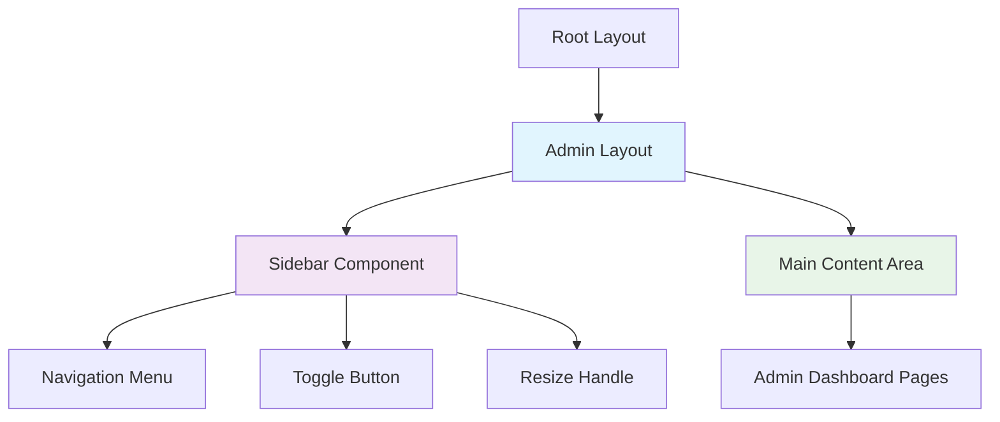

```mermaid
graph TD
    A[Root Layout] --> B[Admin Layout]
    B --> C[Sidebar Component]
    B --> D[Main Content Area]
    C --> E[Navigation Menu]
    C --> F[Toggle Button]
    C --> G[Resize Handle]
    D --> H[Admin Dashboard Pages]

    style B fill:#e1f5fe
    style C fill:#f3e5f5
    style D fill:#e8f5e8
```
